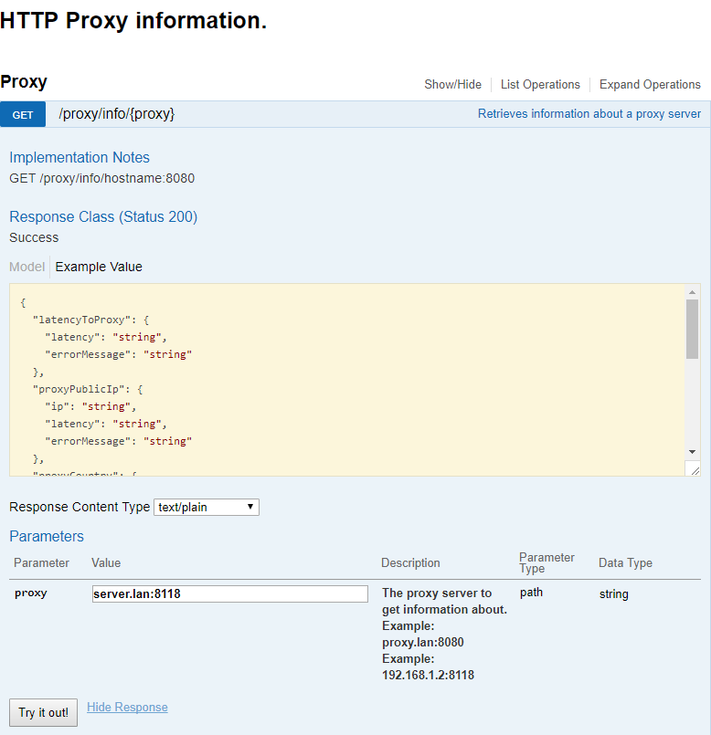

# HTTP Proxy Control

With a [simple solution using Docker and OpenVPN+Privoxy](https://github.com/bruno-garcia/docker-openvpn-proxy)
it's possible to have HTTP proxies (and network gateways) in your local network which allow you browse using IP addresses of different countries. 

This is especially useful to watch Netflix from different countries amongs other things. While the proxy is handy to configure directly on a web browser, the network gateway can be directly configured to a smart TV so all traffic from the TV goes through the tunnel (and the country) of the backing VPN.

The motivation to this little API was to provide data to web page which contains status information about these tunnels. One situation that has happend before was the VPN connection dropping and not reconnecting. The HTTP proxy and network gateway continued to work but the connections through those ended up using the local network's gateway instead. Another point is sudden latency spikes and buffer times on streaming services.

## Getting information about a proxy

### GET /proxy/info/host:port

This endpoint returns:

* Public IP address of the current network
* Public IP address of the proxy (i.e: VPN tunnel)
* Country of the current network's IP address
* Country of the proxy server's IP address
* Latency to the proxy server tested with ICMP echo

The overall response time will be around the same as the longest dependency took to respond. Keeping in mind that to resolve the country the API first needs to get the external IP address. It does so in two calls to external services.

### Running

.NET Core 2 SDK is required to build and run:

#### To run it in development mode

```shell
git clone https://github.com/bruno-garcia/HttpProxyControl.git
cd HttpProxyControl
dotnet run

```

An example of setting it up on Linux with iptables:

```shell
git clone https://github.com/bruno-garcia/HttpProxyControl.git
cd HttpProxyControl
# choose a port
port=31337
iptables -A INPUT -i eth0 -p tcp --dport $port -j ACCEPT
export ASPNETCORE_URLS=http://*:$port
dotnet publish HttpProxyControl.sln -c Release -o out
dotnet out/HttpProxyInfo.dll

```

Example call:
```shell
curl -X GET --header 'Accept: application/json' 'http://server/proxy/info/proxy.lan%3A8118'
```
```json
{
  "latencyToProxy": {
    "latency": "00:00:01.0052416",
    "errorMessage": "TimedOut"
  },
  "proxyPublicIp": {
    "ip": "128.90.1.1",
    "latency": "00:00:00.8936781"
  },
  "proxyCountry": {
    "country": "CH",
    "latency": "00:00:00.4429030"
  },
  "serverPublicIp": {
    "ip": "84.114.1.1",
    "latency": "00:00:00.5943200"
  },
  "serverCountry": {
    "country": "AT",
    "latency": "00:00:00.5102278"
  }
}
```

The proxy server is filtering ICMP so latency check times out after 1 second.

```json
{
  "latencyToProxy": {
    "latency": "00:00:00.0020000"
  },
  "proxyPublicIp": {
    "ip": "69.167.1.1",
    "latency": "00:00:00.1275722"
  },
  "proxyCountry": {
    "country": "US",
    "latency": "00:00:00.1689354"
  },
  "serverPublicIp": {
    "ip": "84.114.1.1",
    "latency": "00:00:00.1393001"
  },
  "serverCountry": {
    "country": "AT",
    "latency": "00:00:00.1799295"
  }
```

Another call with a successful response to the ICMP echo request.

### Swagger

The code generates OpenAPI information (aka: swagger) and includes swagger UI:




### External APIs

> To verify the public IP address, the code calls: [https://api.ipify.org](https://api.ipify.org).
>
> To verify the country of that IP address: [https://ipinfo.io/{ipAddress}/country](https://ipinfo.io/).